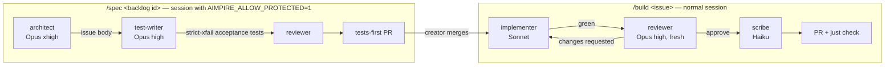

# Agent team and model routing

How Claude Code sessions put [ADR-0016](../adr/0016-agent-guard-rails-and-model-tiering.md)'s tiers
into practice inside one session: the strongest model plans, writes acceptance tests and reviews,
a mid-tier model writes the code, and a small model does mechanical documentation. Decision record:
[ADR-0022](../adr/0022-agent-team-guard-hooks-and-repo-hygiene.md). Verified against the Claude Code
docs on 2026-10-04: [subagents](https://code.claude.com/docs/en/sub-agents),
[model config](https://code.claude.com/docs/en/model-config), [hooks](https://code.claude.com/docs/en/hooks).

## Why split by model
- **Planning, acceptance tests and review decide quality.** A wrong plan, a weak test or a missed
  invariant costs far more than the tokens to think about it, so they get Opus at high or extra-high
  effort.
- **Implementing a precise issue against existing failing tests is well-specified work.** Sonnet does
  it well for a fraction of the usage. Mechanical docs go to Haiku.
- **Separate contexts keep tests honest** (ADR-0016's evidence on test gaming): the agent that
  writes the acceptance tests is not the one that makes them pass, and the reviewer has never seen
  the work.
- Development runs on the creator's Claude subscription (ADR-0009), so "cost" is plan usage: cheaper
  models mean more issues per usage window.

## The team (`.claude/agents/`)

| Agent | Model | Effort | Tier | Tools | Role |
|---|---|---|---|---|---|
| main session (orchestrator) | `opus` | `high` | S | all | decomposes, delegates, decides, runs `just check` |
| `architect` | `opus` | `xhigh` | S | read, web, docs edits | issue body (task template), Proposed ADRs |
| `test-writer` | `opus` | `high` | S | read, edit, bash | acceptance tests (strict xfail), interface stubs |
| `implementer` | `sonnet` | `medium` | I | read, edit, bash | code plus its own unit/property tests; protected paths blocked |
| `reviewer` | `opus` | `high` | S | read, bash | fresh-context review, verdict |
| `ui-auditor` | `sonnet` | `medium` | I | read, bash | Tufte and accessibility audit with screenshots |
| `researcher` | `sonnet` | `medium` | I | read, web | versions, APIs, prices, model IDs with sources |
| `scribe` | `haiku` | `low` | small | edit Markdown | STATUS, handoffs, logs, indexes |
| built-in `Explore` | its own default | — | small | read-only | broad code search |

Defaults live in `.claude/settings.json`: `model`, `effortLevel`, and
`CLAUDE_CODE_SUBAGENT_MODEL=sonnet` for any unnamed subagent. An agent's own `model` and `effort`
frontmatter override the session for that agent only. Aliases (`opus`, `sonnet`, `haiku`) follow the
latest release; pin a full model ID only if a regression is found, and log why.

## The two loops

- **`/spec`** follows the backlog rule: acceptance tests are written by the S tier and merged before
  the implementing issue opens. Writing them needs `AIMPIRE_ALLOW_PROTECTED=1`.
- **`/build`** runs in a normal session. The `implementer`'s own hook forces
  `AIMPIRE_ALLOW_PROTECTED=0`, so it cannot touch protected paths even if the session allows them.
  Removing an `xfail` mark is done by the orchestrator in an allowed session, or listed in the PR
  for the creator.

## Escalation and judgement calls
- **Implementer stuck** (same failure twice, or it reports a test contradicts the spec): the
  orchestrator decides. Re-plan with `architect`, ask the creator, or rerun that step with a
  per-invocation `model: opus` override. Never weaken a test.
- **Track the tiers** (ADR-0016 §1): note in the PR the first-pass CI result and review defects per
  agent, so work can move up or down a tier on evidence.
- **Small, obvious changes** (typo, one-line doc fix) may be done directly by the orchestrator.
- **Parallel work** only on disjoint files; for independent backlog items use separate sessions and
  worktrees (`isolation: worktree` is available per agent).

## Changing the routing
- Personal override without touching the repo: `.claude/settings.local.json` (gitignored), or
  `/model` and `/effort` in a session.
- Cheaper single-context alternative: `/model opusplan` (Opus in plan mode, Sonnet when executing).
  It keeps no fresh-context review and no role split, so the loops above still apply.

## Enforcement

| Rule | Mechanism |
|---|---|
| Session starts from STATUS, the handoff note and the routine | `SessionStart` hook (`session_start.py`) |
| Protected paths stay untouched by implementers | `protect-paths.py` (ADR-0016) + the implementer's forced-strict hook |
| No push to main, unsafe force, skipped hooks, credential leaks, merges, releases | `guard_bash.py` + narrowed `permissions` |
| Files stay under the hard limit; tooling formatted | `post_edit_check.py` and `just check-repo` |
| Progress recorded | `Stop` hook reminder (`stop_check.py`) |
| Everything above, independent of the agent | `just check` in CI (`check-sim` runs `check-repo`), required check `ci-ok` |

Hooks are tested in `tools/tests/`. They are guardrails, not security boundaries; CI and
fresh-context review remain the gates (see [limitations](../limitations.md)).
