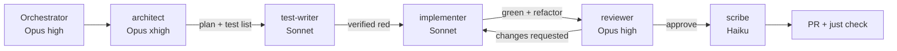

# Agent team and model routing

How Claude Code work is split between models so planning gets the strongest reasoning and bulk
coding runs on cheaper models. Rules for roles are in [AGENTS.md §5.1](https://github.com/seedfourtytwo/aimpire/blob/main/AGENTS.md);
this page is the Claude Code wiring. Verified against the Claude Code docs on 2026-10-04:
[subagents](https://code.claude.com/docs/en/sub-agents), [model config](https://code.claude.com/docs/en/model-config),
[hooks](https://code.claude.com/docs/en/hooks).

## Why split by model

- **Planning and review decide quality.** A wrong plan or a missed invariant costs far more than
  the tokens to think about it, so they get Opus at high or extra-high effort.
- **Implementation against a precise plan and failing tests is well-specified work.** Sonnet does it
  well at a fraction of the usage. Mechanical documentation goes to Haiku.
- **Separate contexts keep TDD honest.** The agent that writes tests is not the one that makes them
  pass, and the reviewer has never seen the work.
- Development runs on the creator's Claude subscription (ADR-0009), so "cost" here means plan usage
  limits: cheaper models mean more work per usage window.

## The team

| Agent | Model | Effort | Tools | Role |
|---|---|---|---|---|
| main session (orchestrator) | `opus` | `high` | all | decomposes, delegates, decides, runs `just check` |
| `architect` | `opus` | `xhigh` | read, web, docs edits | plans, test lists, ADR drafts |
| `test-writer` | `sonnet` | `medium` | read, edit, bash | red phase |
| `implementer` | `sonnet` | `medium` | read, edit, bash; **tests blocked by hook** | green + refactor |
| `reviewer` | `opus` | `high` | read, bash | fresh-context review, verdict |
| `ui-auditor` | `sonnet` | `medium` | read, bash | Tufte/WCAG audit with screenshots |
| `researcher` | `sonnet` | `medium` | read, web | verify versions, APIs, model IDs |
| `scribe` | `haiku` | `low` | edit Markdown | STATUS, handoffs, logs, nav |
| built-in `Explore` | (its own default) | — | read-only | broad code search |

Defaults live in `.claude/settings.json` (`model`, `effortLevel`, and
`CLAUDE_CODE_SUBAGENT_MODEL=sonnet` for any unnamed subagent). Each agent's own `model` and
`effort` frontmatter overrides the session for that agent only.

## The loop (`/tdd <issue>`)

## Escalation and judgement calls

- **Implementer stuck** (same failure after two attempts, or it reports a test contradicts the
  spec): the orchestrator decides. Options are re-plan with `architect`, or re-run `implementer`
  with a per-invocation `model: opus` override for that step only.
- **Small, obvious changes** (typo, one-line fix, doc wording) may be done directly by the
  orchestrator, still test-first where code is involved.
- **Parallel work:** only steps that touch disjoint files. For independent epics use separate
  sessions on separate branches/worktrees (`isolation: worktree` is available per agent).
- **Never** let two agents edit the same file concurrently.

## Changing the routing

- Personal override without touching the repo: `.claude/settings.local.json` (gitignored), or
  `/model` and `/effort` in a session.
- Cheaper whole-session alternative: `/model opusplan` uses Opus in plan mode and Sonnet when
  executing. The subagent split above still applies.
- Model aliases (`opus`, `sonnet`, `haiku`) track the latest version, so the team upgrades
  automatically. Pin a full model ID in an agent file only if a regression is found, and record why
  in the decision log.

## Enforcement

| Rule | Mechanism |
|---|---|
| Session starts from STATUS and the routine | `SessionStart` hook (`session_start.py`) |
| Area rules load when touching sim, client or tests | path-scoped `.claude/rules/*.md` |
| Implementer cannot edit tests/fixtures | agent-scoped `PreToolUse` hook (`guard_tests.py`) |
| No force-push, push to main, `--no-verify`, `.env` reads, literal keys, releases | `PreToolUse(Bash)` hook (`guard_bash.py`) + `permissions.deny` |
| Files stay under 500 lines; Python formatted | `PostToolUse` hook (`post_edit_check.py`) and CI `repo-hygiene` |
| STATUS updated after code changes | `Stop` hook reminder (`stop_check.py`) |
| Everything above, independent of the agent | CI (`just check`), required check `ci-ok` |

Hooks are tested in `tools/tests/test_hooks.py`. Hooks are guardrails, not security boundaries: a
determined agent could route around them, which is why CI and fresh-context review remain the gates.
