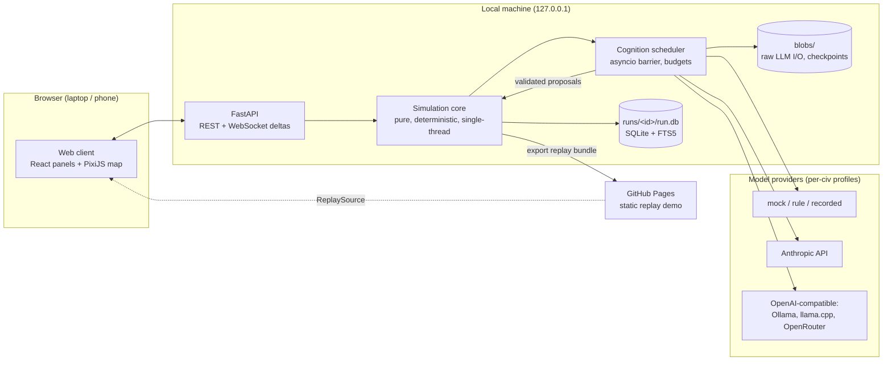
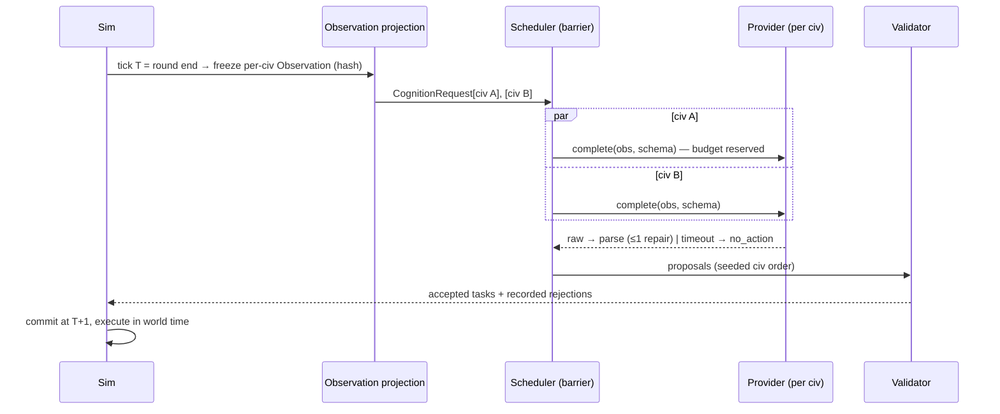

# Architecture overview

Status: planning baseline, 2026-10-04. Derived from ADRs 0002–0009.

## System context

## The cognition round (research mode)

Key rules:
- **The sim never waits on wall-clock time.** Latency is recorded and never turned into turns.
- **Truth, evidence and belief are separate types.** `hidden_cause` and other civilizations' private data cannot be represented in an Observation.
- **Speech and visions are quoted data inside the observation,** never system-prompt content.

## Module map (`sim/src/aimpire/`)

| Package | Responsibility | May import |
|---|---|---|
| `sim/` | state, ids, fixed-point, rng, hashing, tick phases, fields, agents, knowledge, actions (schema/validate/execute), rules loader | stdlib, numpy, pydantic (contracts) |
| `cognition/` | scheduler, providers, prompt rendering, budgets, qualification | `sim`, `contracts` |
| `persistence/` | SQLite, migrations, blobs, checkpoints, replay, branching | `sim`, `contracts` |
| `contracts/` | Pydantic API/WS/proposal models → `schema/` | pydantic |
| `api/` | FastAPI routes, WebSocket stream | all of the above |
| `cli/` | `aimpire run / replay / branch / batch / qualify / export / serve` | all |

## Data flow for inspection

Every consequence is linkable:

`Intervention|NaturalCause → Event (truth) → Evidence (per witness) → Claim/Belief → Observation (hash) → Decision (prompt hash, raw blob, parsed, validation) → Task → Ledger entries / new Events`

`GET /runs/{id}/trace/{event_id}` walks this graph. The web client's Link Tracer renders it.

## Extension points (named, not built)
- births and aging
- multiple settlements per civilization
- institutions as carriers
- hydrology and irrigation
- rules v2 (metallurgy and later eras)
- map chunking for 256² worlds
- faction minds
- interactive asynchronous play mode
- Godot map renderer consuming the replay/delta contract
