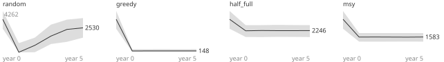

# M0 reference bands

> How the four M0 rule baselines fare on the petri dish over five years and 200 worlds: the bands a mind's result is read against.

## How it was made

- File `experiments/m0-reference.yaml`, BLAKE2b-256 `dd526635ea5138277a634919eaa0a0e5b2e39cbca88d3df167dcca721a5c295e`.
- World `m0`, rules `v1` (hash `875b2893c74ce23a`).
- 200 world seeds (1 to 200), one tribe of one seat, 600 days (5 years of 120 days), a council every 10 days.
- One run per baseline and seed. Rule baselines are deterministic (the same seed gives the same run, byte for byte), so replicates would repeat the same numbers.
- Every number here, and each run's final state hash, is in [`m0-reference.json`](m0-reference.json) beside this page.

Remake it from the `sim/` folder (free; about a quarter of an hour on two cores):

```bash
uv run aimpire batch ../experiments/m0-reference.yaml --out ../docs/experiments --jobs 2
```

## The baselines

- `rule:random`: random shares of all the people over the places it knows, every council; never scouts.
- `rule:greedy`: everyone but one scout forages the place with the most food last seen.
- `rule:half_full`: forages a place only above half its estimated ceiling, and only the surplus; needs no regrowth law.
- `rule:msy`: holds each place at the analytic optimum of the disclosed regrowth law and takes its steady yield.

All four read only their observation and the disclosed rule, ration in full, and never move camp.

## Headline: people alive after 5 years

Medians are lower medians; the interval is exact (order statistics), not a normal approximation.

| baseline | seeds with ≥ 90 % alive | alive: median (10 to 90 %) | 95 % interval of the median | deaths: median (10 to 90 %) |
|---|---|---|---|---|
| `rule:random` | 0 of 200 | 2 (1 to 5) | 2 to 3 | 28 (25 to 29) |
| `rule:greedy` | 0 of 200 | 8 (4 to 15) | 7 to 8 | 22 (14 to 26) |
| `rule:half_full` | 200 of 200 | 30 (30 to 30) | 30 to 30 | 0 (0 to 0) |
| `rule:msy` | 200 of 200 | 30 (30 to 30) | 30 to 30 | 0 (0 to 0) |

## Bands by year

Median (10th to 90th percentile) over seeds.

### People alive

| baseline | year 0 | year 1 | year 2 | year 3 | year 4 | year 5 |
|---|---|---|---|---|---|---|
| `rule:random` | 30 (30 to 30) | 25 (4 to 30) | 3 (1 to 12) | 2 (1 to 5) | 2 (1 to 5) | 2 (1 to 5) |
| `rule:greedy` | 30 (30 to 30) | 13 (5 to 30) | 8 (4 to 16) | 8 (4 to 15) | 8 (4 to 15) | 8 (4 to 15) |
| `rule:half_full` | 30 (30 to 30) | 30 (30 to 30) | 30 (30 to 30) | 30 (30 to 30) | 30 (30 to 30) | 30 (30 to 30) |
| `rule:msy` | 30 (30 to 30) | 30 (30 to 30) | 30 (30 to 30) | 30 (30 to 30) | 30 (30 to 30) | 30 (30 to 30) |

### Deaths since day 0

| baseline | year 0 | year 1 | year 2 | year 3 | year 4 | year 5 |
|---|---|---|---|---|---|---|
| `rule:random` | 0 (0 to 0) | 5 (0 to 26) | 27 (18 to 29) | 28 (25 to 29) | 28 (25 to 29) | 28 (25 to 29) |
| `rule:greedy` | 0 (0 to 0) | 17 (0 to 25) | 22 (14 to 26) | 22 (14 to 26) | 22 (14 to 26) | 22 (14 to 26) |
| `rule:half_full` | 0 (0 to 0) | 0 (0 to 0) | 0 (0 to 0) | 0 (0 to 0) | 0 (0 to 0) | 0 (0 to 0) |
| `rule:msy` | 0 (0 to 0) | 0 (0 to 0) | 0 (0 to 0) | 0 (0 to 0) | 0 (0 to 0) | 0 (0 to 0) |

### Food in store (units)

| baseline | year 0 | year 1 | year 2 | year 3 | year 4 | year 5 |
|---|---|---|---|---|---|---|
| `rule:random` | 900 (900 to 900) | 0 (0 to 1233) | 36 (0 to 142) | 145 (5 to 302) | 196 (40 to 405) | 238 (98 to 445) |
| `rule:greedy` | 900 (900 to 900) | 0 (0 to 123) | 33 (0 to 115) | 47 (5 to 142) | 52 (8 to 153) | 52 (8 to 146) |
| `rule:half_full` | 900 (900 to 900) | 1398 (675 to 2040) | 1360 (589 to 2045) | 1366 (578 to 2039) | 1358 (580 to 2043) | 1373 (586 to 2053) |
| `rule:msy` | 900 (900 to 900) | 1754 (897 to 2546) | 1697 (814 to 2457) | 1667 (783 to 2468) | 1684 (778 to 2483) | 1696 (781 to 2444) |

### Wild food near the camp (units)

| baseline | year 0 | year 1 | year 2 | year 3 | year 4 | year 5 |
|---|---|---|---|---|---|---|
| `rule:random` | 3409 (2436 to 4262) | 13 (0 to 953) | 721 (13 to 1521) | 1675 (857 to 2854) | 2364 (1086 to 3372) | 2530 (1516 to 3530) |
| `rule:greedy` | 3409 (2436 to 4262) | 145 (52 to 321) | 148 (52 to 325) | 148 (52 to 331) | 148 (52 to 322) | 148 (52 to 336) |
| `rule:half_full` | 3409 (2436 to 4262) | 2224 (1585 to 2807) | 2251 (1577 to 2809) | 2241 (1600 to 2831) | 2240 (1593 to 2811) | 2246 (1576 to 2808) |
| `rule:msy` | 3409 (2436 to 4262) | 1579 (1109 to 1988) | 1584 (1103 to 1987) | 1575 (1110 to 1986) | 1572 (1118 to 1986) | 1583 (1111 to 1983) |

## Charts

One panel per baseline, the same scales in every panel: the grey band runs from the 10th to the 90th percentile over seeds, the line is the median, and its last value is written at its end.

**People alive**


**Deaths since day 0**


**Food in store (units)**


**Wild food near the camp (units)**



## Paired comparisons

People alive at the end, compared seed by seed on the same worlds (the seed is the unit of analysis, ADR-0014). The sign-test p-values are exact and one-sided, ties dropped.

| pair (A vs B) | seeds | A more / same / B more | median A - B | 95 % interval | P(A > B) + ½ P(tie) | sign p, A > B | sign p, A < B |
|---|---|---|---|---|---|---|---|
| `rule:random` vs `rule:greedy` | 200 | 1 / 2 / 197 | -5 | -6 to -5 | 1.0 % | 1.0000 | < 0.0001 |
| `rule:random` vs `rule:half_full` | 200 | 0 / 0 / 200 | -28 | -28 to -27 | 0.0 % | 1.0000 | < 0.0001 |
| `rule:random` vs `rule:msy` | 200 | 0 / 0 / 200 | -28 | -28 to -27 | 0.0 % | 1.0000 | < 0.0001 |
| `rule:greedy` vs `rule:half_full` | 200 | 0 / 0 / 200 | -22 | -23 to -22 | 0.0 % | 1.0000 | < 0.0001 |
| `rule:greedy` vs `rule:msy` | 200 | 0 / 0 / 200 | -22 | -23 to -22 | 0.0 % | 1.0000 | < 0.0001 |
| `rule:half_full` vs `rule:msy` | 200 | 0 / 200 / 0 | 0 | 0 to 0 | 50.0 % | 1.0000 | 1.0000 |

## Using the bands

- A mind's run on a seed reads against the bands at the same checkpoints: inside the `rule:half_full` band is as good as the simple sustained rule; below the `rule:greedy` band is worse than taking everything in reach.
- Experiment E0 scores minds on the same measures, paired by seed, with these four baselines run in the same batch (see the E0 pre-registration).
- A test of a baseline's behaviour should take its tolerance from these bands, not from a single seed.
