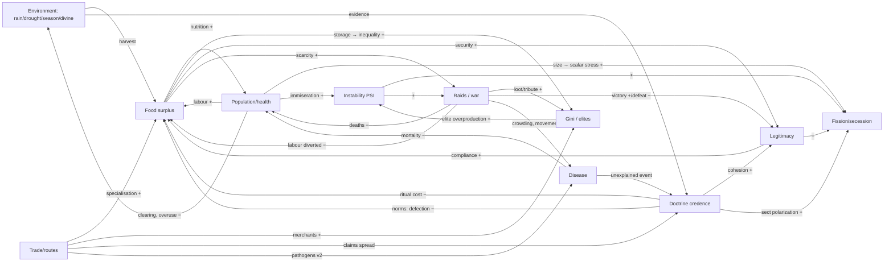

# Aimpire — Social Systems & Multi-Scale Cognition

Status: draft from the social-systems research lead, 2026-10-04. Builds on [`50-simulation-design.md`](50-simulation-design.md) and ADR-0008. It responds to the creator's new priority: logic first, dots on a map later, with trade, religion, politics and fighting "as close to a real-world simulator as possible". All state stays integer (milli-units, ‰, ppm), all randomness uses counter-based RNG streams, and entities iterate in sorted-id order (ADR-0007). New RNG streams: `trade, belief, politics, fission, morale`.

**Design stance.** Every subsystem is a *rule-based individual layer* that runs every tick, cheap and deterministic, plus a *typed proposal surface* for LLM minds that runs every round. The models are drawn from published, testable models (Sugarscape, Boyd–Richerson, Axelrod, Lanchester, Turchin) so each one has a known stylized fact to validate against. Minds steer institutions. They never decide what individuals believe or how a battle resolves.

---

## 1. Economy & trade

### Granularity
Production and consumption stay **per person**, as in v1 tasks. Ownership and exchange move to the **household**, a new entity of about 3–8 people. Households are the smallest unit that can hold property, trade, owe obligations and be measured for Gini. Settlement and polity stores are institutional property, governed by a property regime.

```
Household {hh_id, polity_id, settlement_id, member_ids, store{material: mu},
           obligations{hh_id: mu_food_equiv}, reputation‰, prestige‰, faction_id|null}
PropertyRegime ∈ {COMMUNAL, HOUSEHOLD, TRIBUTE_REDISTRIBUTION}   # per polity, set by law
```

### Production and specialisation
Skills grow by practice, as in v1 (+30 per success). Each week an idle person chooses a task by **comparative advantage at local prices**: `value = expected_output(skill, tile, season) × local_price[material]`. Ties break by the `trade` stream. Specialisation is not scripted. It emerges where skills diverge and exchange exists. With exchange disabled as an ablation, specialisation should collapse; that gives a test.

### Storage and surplus
Spoilage rules from v1 apply unchanged. Surplus is food held above `need × horizon_days`. Surplus is what makes tribute, elites and inequality possible. Kohler et al. (2017) found that wealth Gini rose with domestication and sociopolitical scale, using house-size proxies ([doi](https://www.doi.org/10.1038/NATURE24646)).

### Exchange mechanisms
All four run as rules. A polity's laws and minds choose which ones are allowed.

1. **Bilateral MRS trade** within a settlement, weekly, following Sugarscape G1MT ([Mesa](https://mesa.readthedocs.io/latest/examples/advanced/sugarscape_g1mt.html); [Tesfatsion review](https://faculty.sites.iastate.edu/tesfatsi/archive/tesfatsi/epaxrev.pdf)).
   - Household welfare is Cobb–Douglas over food-days and a durable bundle.
   - The marginal rate of substitution is `MRS = (d/need_d)/(f/need_f)` in ppm.
   - Neighbours trade at the geometric-mean price `p = √(MRS_a·MRS_b)` (integer sqrt) in unit lots, while both gain welfare.
   - Every executed price goes to the ledger as `TRADE`.
2. **Gift exchange and reciprocity.**
   - A household with surplus gifts to a needy household it is tied to (kin, neighbour or faction). This creates an `obligation`.
   - Repayment raises the debtor's reputation. Default lowers it and makes it less likely to receive gifts.
   - This is the default regime before any market law exists.
3. **Tribute and redistribution.**
   - Under `TRIBUTE_REDISTRIBUTION`, the office holder levies `tax‰` of household harvest into the polity store and redistributes by rule (`EQUAL`, `NEED`, `RANK`).
   - The leakage `skim‰` goes to the office holder's household. This is the main route to elite wealth.
4. **Market double auction** at a MARKET structure or trade-meeting tile (v2).
   - Households post integer bids and asks, and the market clears by price-time priority.
   - Gode & Sunder showed that even budget-constrained zero-intelligence traders reach high allocative efficiency (see the review in [arXiv 0909.1974](https://arxiv.org/pdf/0909.1974)), so markets need no LLM.

### Emergent commodity money
- Track each good's **saleability index** `S_g` as an exponential moving average (EMA, in ‰) of how often it is accepted *in order to be traded again*.
- A household accepts an indirect trade in good g when `S_g × (1000 − spoil_rate_g) > accept_threshold`.
- This follows Kiyotaki & Wright (1989): the low-storage-cost good becomes the medium of exchange ([RePEc](https://ideas.repec.org/a/ucp/jpolec/v97y1989i4p927-54.html)). Adaptive agents find this equilibrium in Marimon–McGrattan–Sargent ([QuantEcon](https://python.quantecon.org/marimon_mcgrattan_sargent.html)).
- Expected candidates are FIRED_POT, STONE_EDGE and PRESERVED_FOOD. Nothing is designated as money.

### Inter-polity trade
This stays the v1 `trade` and `negotiate` contract, with the merchant mind (§5) or the leader proposing it. Recurring successful meeting tiles become **trade routes** (`Route{tiles, last_used, volume}`). Routes carry claims, disease (v2) and raiders' attention.

### Inequality
Wealth is the market value of household stores plus structures. Gini is computed each season with an integer Lorenz sum.

---

## 2. Religion & belief

Physics never reads belief. Belief reads only **Evidence in the civ pool**, never `hidden_cause`.

### State
```
Doctrine {doctrine_id, parent_id|null, features[K] (enum ids), predictions[], norms[], rituals[]}
  Prediction {if: RITUAL_DONE(r)|NORM_BROKEN(n)|ACTION(kind)|DIVINE_SPEECH, then: event_kind, tiles|region, within_ticks}
  Norm {forbids: THEFT_FROM_STORE|DEFECT_PUBLIC_GOOD|ATTACK_CORELIGIONIST|…, punisher: GOD|LEADER|COMMUNITY}
Person.adherence{doctrine_id: ‰}, Person.credence{doctrine_id: ‰}, Person.displays_paid (rolling ‰)
```
v1 `Belief` objects become doctrines (K = 6 features: deity set, cause-of-weather, cause-of-illness, ritual, food taboo, afterlife/ancestor stance).

### Transmission
Transmission runs per tick among co-located pairs, drawn from the `belief` stream. A learner L samples a model M and adopts M's variant on one feature with probability:

```
P = base × content(credence_M) × prestige_w(M) × CRED(M) × conform(p_local)
conform(p) = p + D·p(1−p)(2p−1)            # Boyd & Richerson conformist bias, D≈200‰
CRED(M)   = min(1000, 300 + displays_paid_M)  # Henrich 2009: costly displays make beliefs credible
```

- Conformist bias follows Boyd & Richerson ([book](https://chicagoreference.com/ucp/books/book/chicago/C/bo5970597.html)).
- CRED (credibility-enhancing displays) follows Henrich ([pdf](https://www2.psych.ubc.ca/~henrich/pdfs/evolution%20of%20costly%20displays%20_henrich%202009.pdf)).
- `prestige_w` follows Henrich & Gil-White: prestige is freely conferred deference to people who succeed ([Harvard](https://coevolution.fas.harvard.edu/publications/evolution-prestige-freely-conferred-deference-mechanism)).
- Feature-level copying with similarity-gated interaction is Axelrod's dissemination model ([JCR 1997](https://journals.sagepub.com/doi/10.1177/0022002797041002001)): interaction probability equals feature overlap. This yields local convergence with global polarization, so sects arise naturally.

### Rituals as costly signals
`perform_ritual` is a task that consumes labor and goods (burn GRAIN, build a SHRINE). Participants gain `displays_paid` and cohesion. Cohesion lowers the defection rate in public-goods tasks and raises morale (§4).

### Divine interventions as evidence
- After each event, the bookkeeping layer scores every active doctrine prediction against the civ's Evidence: `CONFIRMED / DISCONFIRMED / UNTESTED`.
- Credence moves `+c` for confirmed and `−d` for disconfirmed, with `d > c` by default, both per adherent who perceived it.
- A priest mind may propose `reinterpret` (an auxiliary hypothesis). This restores some credence at a reputation cost to the priest and is logged as a rationalisation.
- Player-god speech is a `MESSAGE` evidence. Whether it is "the god" is a doctrine feature, not a fact.
- Natural weather uses the same event kinds (v1 §7), so false confirmations happen, and that is the point.

### Moralizing norms
- Adherents of a doctrine with a GOD-punished norm defect less: `p_defect × (1000 − adherence·monitoring/1000)`.
- **We do not hard-code moralizing gods → complexity.** The 2019 Seshat Nature paper claiming complex societies precede moralizing gods was retracted. The critique by Beheim et al. showed that missing data had been coded as absence ([Retraction Watch](https://retractionwatch.com/2021/07/07/critique-topples-nature-paper-on-belief-in-gods/)). A later "retake" re-argued the conclusion ([Turchin](https://peterturchin.com/publications/testing-the-big-gods-hypothesis-with-global-historical-data-a-review-and-retake/)).
- We record the moralizing-norm ↔ scale correlation as an **observed metric**, never a target.

### Schism
A sect forms when:
- a connected cluster of at least `sect_min` adherents (default 6) has mean feature distance of at least 2 from the parent doctrine, and
- the cluster contains a person with `prestige ≥ 600`.

The schism creates a child doctrine with `parent_id`. Sect membership becomes a faction seed (§3).

---

## 3. Politics & governance

### State
```
Polity {polity_id, settlement_ids, offices[], laws[], institution: BAND|CHIEFDOM|COUNCIL|ASSEMBLY, store_ids, legitimacy‰, treaties[]}
Office {office_id, kind: LEADER|PRIEST|WAR_CHIEF|TRADE_MASTER|COUNCIL_SEAT, holder_person_id, selection: PRESTIGE|DOMINANCE|HEREDITARY|COUNCIL|ELECTION, term_rounds|null, authority: [action_kind]}
Faction {faction_id, polity_id, basis: SECT|OCCUPATION|SETTLEMENT|HOUSEHOLD_LINE, member_hh_ids, demands{tax‰_max, ration_min, war: ±, doctrine}, support‰}
Law {law_id, kind: TAX|PROPERTY_REGIME|RATION|NORM_ENFORCEMENT|MARKET_ALLOWED|SUCCESSION, params, enacted_round}
Person.prestige‰, Person.dominance‰ (health × strength × aggression trait)
```

### Leadership selection
Selection is rule-resolved by the polity's `SUCCESSION` law.
- **PRESTIGE:** prestige-weighted plurality of adults (deference networks).
- **DOMINANCE:** the challenger with the highest dominance wins a contest (`politics` draw weighted by dominance; injuries possible).
- **COUNCIL:** faction heads vote, weighted by support.
- **ELECTION:** household vote.
- **HEREDITARY:** needs births and lineages (v2).

A mind can *propose* changing the law. Enactment needs authority plus a supporting-faction weight above 500‰.

### Legitimacy
Legitimacy is updated each round:
```
ΔL = +a·food_security + b·victories + c·ritual_endorsement(dominant_sect)
     − d·famine_deaths − e·defeats − f·max(0, tax‰ − customary_tax‰) − g·disconfirmed_leader_prophecies
```
Low legitimacy means a lower compliance rate. Each task assignment from the office holder succeeds with probability `L‰`; the rest are "shirked", and executed labor is measured. It also raises challenge and fission hazard.

### Factions and coalitions
- Each round a faction's support is recomputed from member satisfaction against its demands.
- Factions above 300‰ support with satisfaction below 400‰ emit `GRIEVANCE` evidence that the leader can see.
- Factions form coalitions by demand similarity, the same Axelrod-style overlap.

### Fission and secession
The per-season fission hazard for a settlement with N people is:
```
h = σ(N / scalar_cap − 1) × (1000 − L)/1000 × (1 + faction_polarization)
scalar_cap = 60 base; ×1.5 per integrative institution (COUNCIL, shared ritual site, written law)
```
- Scalar stress (Johnson 1982) and logistic fission models are reviewed in [PLOS ONE 2014](https://www.ncbi.nlm.nih.gov/pmc/articles/PMC3953443/). Bandy documents Formative villages that fissioned until a regional religious tradition integrated them ([summary](https://www.mapaspects.org/biblio/ref_7194/index.html)), which is a direct religion→politics link.
- On fission, the dissatisfied faction migrates. It takes its household stores and claim carriers, and founds a new polity. A **new mind may be created** (§5).

### Turchin structural-demographic theory (SDT) as a validation pattern (v2, needs births)
- Popular immiseration: `MMP` = food-per-capita relative to need, inverted.
- Elite overproduction: `EMP` = office aspirants (households with prestige or wealth in the top decile) per office.
- State fiscal distress: `SFD` = obligations divided by store.
- `PSI = MMP·EMP·SFD` should lead instability (challenges, fission, internal violence) in long runs ([Secular Cycles](https://ingramacademic.com/products/secular-cycles-9780691136967)). We test the lead–lag. We do not script it.

### Diplomacy
Diplomacy uses the v1 `negotiate` types, plus TRIBUTE terms, MARRIAGE_EXCHANGE (v2) and JOINT_RITUAL. Treaty compliance is tracked, and violation lowers `reputation` in the other polity's observation.

---

## 4. Conflict & fighting

This replaces v1's single `sA/(sA+sD)` draw with **time-stepped engagements**.

### Modes
- **RAID:** a small party, surprise bonus, targets stores or people at the edge. Most deaths in non-state warfare come from raids and ambushes, not pitched battles.
- **BATTLE:** both sides muster.
- **SIEGE:** an attack on a PALISADE or settlement.
- **DUEL:** a leadership contest.

### Attrition per tick
The engagement lasts at most 3 ticks per day while both sides hold. Generalised Lanchester attrition:
```
loss_B = k_A × A^α × B^(1−α) × terrain × fort_B⁻¹ × surprise
α = 0 → linear law (melee frontage-limited), α = 1/2 default, α = 1 → square law (aimed missiles, open ground)
```
Historical fits do *not* give one law. Willard's battles from 1618 to 1905 gave anomalous exponents, and fits depend on posture ([Dupuy Institute](https://dupuyinstitute.org/2018/05/02/the-lanchester-equations-and-historical-warfare)). So α is a rules parameter with per-mode defaults and is unit-tested, not tuned to look exciting.

### Morale and rout
```
morale_0 = 400 + cohesion(ritual, sect unity) + legitimacy/4 + leader_present·100
Δmorale/tick = −(casualty_fraction_tick × 3000) − flanked·150 + defending_home·50
rout when morale < 250 or casualties ≥ 30%; pursuit: loser takes extra loss at 2× winner's rate for 1 tick
```
Most fatal casualties come in the rout. Each loss becomes a per-person injury-or-death draw (`combat` stream), roughly 1 death per 3 losses. Injuries reduce health and labor for weeks. This prevents cartoon annihilation: a typical non-rout engagement kills under 10%.

### Costs and stakes
- Mustered labor leaves farming, and the loss is measured.
- Food is consumed on campaign.
- Loot is capped at 30%, and archives can be seized.
- Displaced households become refugees and switch polity with their claims.

**Territory.** A tile is claimed by a polity with continuous use for at least 30 ticks. A contested claim is `TERRITORY_DISPUTE` evidence.

### Evolutionary game theory
- Public-goods tasks (granary, palisade, defence) are N-person games. Each household contributes with `p_contrib` = norm × reputation-sensitivity.
- Defectors are punished under NORM_ENFORCEMENT law at a cost to the punisher.
- Bowles (2009) argued that ancestral warfare mortality (~14% of adult deaths in his sample) could sustain in-group altruism ([AAAS summary](https://www.aaas.org/news/science-two-studies-consider-new-possibilities-emergence-modern-human-behavior)). Our analogue is that inter-polity conflict should raise in-group contribution rates. That is testable, not assumed.
- At macro scale, Turchin et al. (2013) reproduced the spread of Old World complex societies from military-technology diffusion plus geography ([pub](https://peterturchin.com/publications/war-space-and-the-evolution-of-old-world-complex-societies/)). This is a long-horizon benchmark for larger maps.

---

## 5. Multi-scale cognition

### What runs where

| Layer | Who | Cadence | Decides |
|---|---|---|---|
| Physics & bookkeeping | sim | every tick | weather, growth, spoilage, attrition, morale, prediction scoring |
| Individual rules | every person/household | every tick / week | eat, rest, flee; task choice by price; bilateral trade; gifts; belief copying; contribution or defection; compliance; vote; fight or rout |
| Faction logic | rule-based | per round | support, demands, grievance, coalition, fission hazard |
| **Minds (LLM)** | office holders | per round or on trigger | allocations, laws, tax, rituals, doctrine (re)interpretation, trade offers, treaties, muster, raid or war, appointments |

Minds act **only through offices**. Each office has an `authority` list of action kinds. All minds of a polity propose in parallel at the same barrier, on one frozen observation each, filtered to what that office holder's network knows. The sim arbitrates deterministically:
1. An action outside the office's authority is rejected with `UNAUTHORIZED`.
2. Actions that need consent (war, a new law) pass only if the institution's rule is satisfied. Under COUNCIL, that means the weighted support of faction minds and rule-factions that did not object exceeds 500‰.
3. Conflicting resource reservations resolve by office precedence, then id.

All existing guarantees hold: typed proposals, partial acceptance and order-independence.

New typed actions: `set_law, levy, redistribute, appoint, perform_ritual, preach, reinterpret, petition, challenge, secede, gift, post_order, muster, fortify`.

### Options

Options are counted per simulated year at 36 rounds per year.

| Option | Minds | Calls/yr (2 polities) | Calls/yr (6 polities, v2 world) | Pros / cons |
|---|---|---|---|---|
| A. One per civ (v1 today) | 1/polity | 72 | 216 | cheapest, cleanest model comparison; no internal politics |
| B. Per faction | 1 + F (F≈3) | 288 | 864 | real internal politics; factions in a 30-person band are artificial |
| C. Per role (leader, priest, war chief, trade master) every round | 4/polity | 288 | 864 | rich; mostly idle minds burn calls |
| **D. Dynamic** | leader every round; a sub-mind is **spawned when an emergent condition holds** (sect ≥ 6 adherents → priest mind; hostilities → war chief; trade volume ≥ threshold → trade master; fission → new polity leader). Sub-minds run every 3rd round plus on trigger (≤4/yr), capped at 3 per polity | 72 + n_sub·16 → **~168** with 3 sub-minds each | 216 + 18·16 = **~504** | cost tracks social complexity; minds have a historical reason to exist; needs a mind budget for fairness |

Cost: the [model-layer](30-model-layer.md) estimate is ~$0.010/call on Haiku 4.5, $0.020 on Sonnet 5.5 and $0.040 on Opus 5.5, with 5k in and 1k out.
- **D at 2 polities**, 168 calls: ≈ $1.7 / $3.4 / $6.7 per sim-year.
- **D at 6 polities**, 504 calls: ≈ $5 / $10 / $20.
- **Local inference** on the 8 GB RTX 2070: assume ~20–40 s per 1k-token reply, to be measured in qualification. 168 serial calls is then ≈ 1–2 h of wall clock per sim-year. That is fine for research mode but argues for a CPU or 3060 server running in parallel.

Generative Agents ([arXiv 2304.03442](https://arxiv.org/abs/2304.03442)) and Project Sid ([arXiv 2411.00114](https://arxiv.org/abs/2411.00114)) show per-person LLM agents are possible but costly. Sid also reports say/do incoherence without a bottleneck. **Per-person LLM cognition is rejected.** Individuals stay rule-based.

### Fairness rules
- All minds of a polity use that polity's model profile. A cross-model-within-polity setting is an explicit ablation.
- Every polity gets the same `mind_budget` (calls per year), the same caps and the same spawn thresholds.
- Mind creation is an event with provenance: `Mind{mind_id, office_id, polity_id, created_round, trigger_event_id, profile_id}`.

### Recommendation
- **v1, the social slice:** **Option A plus office plumbing.**
  - One leader mind per polity, but the polity is *dynamic*: fission creates a new polity and a new mind.
  - Factions, priests and merchants exist as **rule-based offices and factions** whose demands and grievances appear in the leader's observation and constrain consent.
  - Ships the full rule layer and the arbitration path with ≈72–110 calls per year.
- **v2:** **Option D, dynamic role minds.** Spawning is gated by emergent conditions and capped at 3 sub-minds per polity. Rule-based offices are the fallback when a mind's budget is exhausted or a call times out, and that is disclosed.

---

## 6. Interlocks



The key loops:
- **Malthusian–Turchin balancing:** population → immiseration → instability → war → population.
- **Surplus–elite reinforcing:** storage → inequality → tribute → more storage.
- **Belief–legitimacy reinforcing:** ritual → cohesion → legitimacy → endorsement.
- **Bandy loop:** shared religion raises scalar capacity and suppresses fission.

---

## 7. Validation

Each stylized fact becomes an automated statistical test. Tests run `gf batch` over 20–50 seeds with rule-baseline minds. Thresholds are fixed in `evals/stylized.yaml` and versioned with the rules. Tests marked (v2) need births and aging.

| # | Stylized fact | Test |
|---|---|---|
| E1 | Bilateral trade discovers prices | Cross-household SD of log price falls ≥50% from week 1 to week 12 ([Sugarscape](https://mesa.readthedocs.io/latest/examples/advanced/sugarscape_g1mt.html)) |
| E2 | Random-exchange kernel is sane | Unit test: conservative random pairwise exchange → exponential wealth distribution, KS p > 0.05 ([Drăgulescu–Yakovenko](https://arxiv.org/abs/cond-mat/0001432)) |
| E3 | Storage and farming raise inequality | Season-12 Gini: farming + HOUSEHOLD regime > foraging + COMMUNAL, Mann–Whitney p < 0.01 (Kohler 2017) |
| E4 | ZI double auction is efficient | Allocative efficiency ≥ 90% in a canonical supply/demand fixture |
| E5 | Commodity money emerges | With indirect exchange on, the top-S good is the lowest-spoilage tradeable in ≥70% of seeds; 0% when indirect exchange is off |
| E6 | Specialisation needs exchange | Occupational Herfindahl drops under the no-trade ablation |
| R1 | Axelrod regime | Number of stable cultural regions decreases with F and increases with q in a stand-alone grid fixture |
| R2 | Conformist S-curve | Adoption trajectory fits a logistic better than linear (ΔAIC > 10) when D > 0 |
| R3 | CRED effect | Doctrine spread rate with displays > without, same seeds |
| R4 | Disconfirmation | A rain-ritual doctrine under natural-only weather loses mean credence over 3 years unless `reinterpret` was accepted, and every such case is logged |
| R5 | No physics leak | Mutating credence or doctrine changes no tile, material or event hash (invariant test) |
| P1 | Scalar stress | Fission hazard increases monotonically with N/scalar_cap (logistic fit, slope > 0, p < 0.01) |
| P2 | Integration suppresses fission | A shared ritual site or COUNCIL reduces fission count vs control |
| P3 | Famine erodes legitimacy | DROUGHT vs seed-matched control: legitimacy lower and challenges higher within 2 seasons |
| P4 | SDT lead (v2) | PSI cross-correlates with instability events at positive lag across 50-year runs |
| C1 | Lanchester units | Closed-form α=0 and α=1 fixtures match within ±1 casualty |
| C2 | Rout dominates losses | ≥50% of loser deaths occur in the pursuit phase |
| C3 | No cartoon wars | Median non-rout engagement death rate < 10%; raids account for most deaths in pre-state polities |
| C4 | War is costly | Belligerents' food output and population fall vs control |
| C5 | War–population cycles (v2) | Lagged negative correlation of conflict intensity on population growth, with periodicity detected in long runs |
| X1 | Parochial altruism | In-group public-goods contribution rises when inter-polity conflict is present |
| X2 | Determinism | All social subsystems keep the replay hash and proposal-permutation invariants |

---

## 8. Draft ADR section

### ADR-0012: Social systems & multi-scale cognition

- **Status:** Proposed. When accepted, it amends ADR-0008 ("one cognition controller per civilization").
- **Date:** 2026-10-04
- **Research:** this document.

**Context.** The creator now prioritises simulation logic over graphics. The sim must include trading, religion, politics and fighting at real-world fidelity. ADR-0008's single controller per civ cannot express internal politics, sects or merchants. Per-person LLM agents are too costly and incoherent at scale (Project Sid, Generative Agents).

**Decision.**
1. **Households** own property and trade. Persons still produce and consume.
2. The economy runs as rules:
   - Sugarscape-style bilateral MRS trade, gift/obligation ledgers, tribute and redistribution, and a v2 double auction.
   - Commodity money is emergent through a saleability index. Nothing is designated as money.
3. Religion runs as rules:
   - Doctrines are feature vectors with typed predictions, norms and rituals.
   - Transmission uses conformist, prestige and CRED biases, and Axelrod similarity gating.
   - Credence is updated only from civ-accessible Evidence.
   - Schisms form by cluster divergence.
   - Belief never touches physics.
4. Politics runs as rules:
   - Polities hold offices with authority lists, laws, factions and legitimacy.
   - Succession is set by law.
   - The fission hazard is driven by scalar stress.
   - SDT variables are tracked.
5. Conflict uses time-stepped generalised Lanchester attrition with per-mode α, morale and rout, raids versus battles, injuries and territory by use.
6. **Cognition:**
   - LLM minds attach to **offices**, never persons, and act only within office authority, in parallel at the existing barrier.
   - The sim arbitrates consent and precedence deterministically.
   - **v1:** one leader mind per *polity*, with polities created dynamically by fission, plus rule-based offices and factions.
   - **v2:** dynamic role minds spawned by emergent triggers, ≤3 per polity, with an equal `mind_budget`.
   - All minds of a polity share its model profile.
7. **Births and aging move into scope** for the social slice. Fission, SDT and war–population tests need demographic turnover.
8. Stylized-fact tests (§7) are acceptance criteria and live in `evals/stylized.yaml`.

**Consequences.**
- Cost scales with emergent complexity: ≈72–110 calls/yr in v1 and ≈170–500 in v2 for 2–6 polities, roughly $2–20 per sim-year on cloud models.
- Arbitration and consent rules become a new hot spot for determinism tests.
- New hot files: `rules/v1/social.yaml` and its schema.
- Mixed-model comparisons stay clean at polity level, but v2 compares *institutions + model*, not model alone. Ablations must pin institutions.
- Graphics needs are minimal: dots coloured by polity or sect, plus inspector panels.
