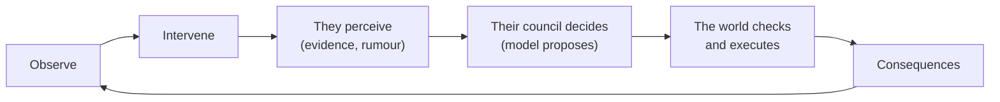

# Vision

> **Untrained AI sandbox. Tribes evolving in an infinitely generative universe.**

A retro civilization research simulator with god-game interactions. Autonomous AI civilizations, each driven by its own selectable model (cloud or local), share one deterministic world. They gather, farm, teach, forget, trade and fight. You are a god who can send rain, drought, lightning, visions and words, but never commands. They may misunderstand you, worship you, or ignore you.

This page is the single statement of intent: what Aimpire is for, where it is going, and which parts are decided, planned or only imagined. How things are built lives in the [ADRs](adr/README.md); what is built next lives in the [roadmap](plan/roadmap.md).

## The idea in one minute

Classic god games (Populous, Black & White, early Age of Empires) gave the player a world full of followers who followed scripts. Aimpire replaces the scripts with minds. Each civilization is run by a language model, or by a small model we train ourselves, that sees only what its people have perceived and remembered, and decides what to do. A deterministic simulation checks every decision against physics and executes only what is possible.

The player sits outside. You can change the weather, show symbols, or speak to one person. You cannot order anything. What a civilization makes of you, whether it builds rituals, splits into factions or decides you are a coincidence, is its own business, and every step of that reasoning is on the record.

**The goal is emergence.** Let the minds decide for themselves and see what kind of civilization, political order and belief arises, then trace the parallels with real history. Nothing that is meant to emerge is written into the code ([ADR-0019](adr/0019-emergence-first.md)).

## The loop

Every link is recorded. For any intervention you can follow the chain **sent → heard → reported → concluded → done**, and for any event you can ask what caused it.

## What "untrained" means here

The tagline is a direction, and it needs a precise meaning, because a pretrained model cannot be told to forget ([ADR-0018](adr/0018-what-the-minds-know.md)).

| Knowledge arm | Mind | World | What it is for |
|---|---|---|---|
| **A0** | Pretrained model | Familiar names and rules | Play, demos, first experiments (M0 to M2) |
| **A1** | Pretrained model told to reason only from what its people saw | Familiar | A cheap check, expected to be weak |
| **A2** | Pretrained model | Unfamiliar: coined names, rules generated per world | Claims about discovery |
| **A3** | **Native mind**: a small model trained from zero on in-world language only | Any | The untrained mind, and the control for every emergence claim |

"Untrained" means **A3**: a mind that has never read human text, trained only on a closed in-world vocabulary and on the chronicles of earlier runs ([ADR-0021](adr/0021-native-mind-track.md), [research note 91](research/91-native-minds.md)). It knows how to want food and avoid harm; it does not know what a plough, a king or a god is. The track started after M0 and never blocks a milestone.

Until native minds qualify, civilizations run on pretrained models, and we say so. A parallel with real history counts as emergent only if it appears in arm A2 or A3. Seen only in A0, it is reported as possibly recalled.

## You are a god, not a commander

Buttons for simple acts, text for complex ones, and no direct line to the council ([ADR-0017](adr/0017-the-gods-channels.md)).

| Channel | You do | Who receives it | Lasts | From |
|---|---|---|---|---|
| **Sign** | Press rain, drought or lightning | Everyone who sees it; it looks like natural weather | No | M1 |
| **Omen** | Pick one to three symbols | Witnesses at a place, or one sleeper | Oral memory | M1 |
| **Voice** | Type up to 280 characters | One person you choose | Oral memory | M1 |
| **Dictation** | Type up to 1,200 characters | A person who can make records | As long as the record and its copies | M3 |
| **Inscription** | Put text on an object in the world | Whoever finds it; unreadable until they can read | As long as the object | M3 |
| **Prayer** | Nothing: they address you | You | The chronicle | M1 |

- **You speak to a person, never to the council.** The council hears only that person's report, and decides what standing that person has.
- **Misunderstanding is a feature with three sources:** words lost at the ear (whisper, speech or thunder; clearer costs more), retelling, and copying across generations.
- **Speech is data, never an instruction.** It arrives quoted inside an observation and cannot bypass validation.

## Worlds you can tune

The **Tinkering Lab** ([ADR-0020](adr/0020-tinkering-lab-and-world-constants.md)) is built: world rates derive from a few constants (gravity, sunlight, rain, axial tilt) through integer scaling laws, so changing gravity moves walking speed, carry load, river speed and tree height together. `aimpire lab twin` runs the same world twice with one change and reports where they first diverge.

At M5, material transformation tables are **generated per seed**, so remembered chemistry is no help to a pretrained model. The long-term vision goes further: generated element tables, other biochemistries (silicon, sulfur), and life seeds that set metabolism, lifespan, senses and sociability. None of that is designed yet.

## The long arc

| Stage | What becomes possible | Status |
|---|---|---|
| **M0 Petri dish** | One group, one regrowing food, named places | Built; experiment E0 next |
| **M1 Seasons and a voice** | Terrain, river, weather, storage; signs, omens, voice, prayer; chronicle; branching; a web console | Planned |
| **M2 Two tribes** | A second civilization on another model; contact, gifts, barter, raids, territory | Planned |
| **M3 Generations** | Births, death, inheritance; knowledge carriers, teaching, records, loss; dictation, inscription | Planned |
| **M4 Living world** | Prey, predators, hunting, disease | Planned |
| **M5 Knowledge** | Experiments on materials; rule tables generated per world | Planned |
| **M6–M8 Exchange, Belief, Rule** | Societies compose their own institutions from seven primitives: control, obligation, rule, role, procedure, sanction, assembly | Planned; designed when M5 closes |
| **The Great Filter** | Interacting existential hazards (escalating war, ecological collapse, dangerous technology) that arise from implemented causal systems, never from a drawn card | Vision |
| **Beyond the planet** | A society that survives leaves its world. Reaching space does not mean every risk is overcome | Vision |
| **The hub** | A god's view of many worlds running in parallel, each pausable or left to run, watched by an observer model that keeps the record | Vision |
| **Emergent multiplayer** | Spacefaring civilizations from different worlds, never designed to meet, find each other: trade, alliance or war | Vision |

*The Great Filter is the last challenge of the campaign, not the name of the game.*

## Making it readable and playable

A simulation the player cannot perceive is worth nothing. The design commits to:

- **A chronicle.** Each council writes a line or two of annals; the simulation adds the facts. Leaders and places get names. The text never touches physics.
- **The trace as gameplay.** After an intervention, show what they witnessed, concluded and did. The same view is the research inspector.
- **Forked timelines.** Branch from a checkpoint and run one season with and without your rain. It is sound research and the most god-like act available.
- **Challenges before a campaign.** Scenario cards with a goal, such as "bring both tribes through three winters without speaking". Each card is also an experiment template.
- **Feedback at three scales:** one person's story after a vision, aggregate charts of what changed, and an immediate sign that something landed.

**Three levels of control** (vision): a simple mode with presets and a handful of buttons, a medium mode with world and personality presets, and a research mode with every knob, the truth-versus-perception view and the batch runner. The same simulation runs underneath all three; the Lab and the research console come first.

## Decided, planned, imagined

| Idea | Status | Where |
|---|---|---|
| Rules decide; models only propose | **Decided** | ADR-0005, ADR-0013 |
| Deterministic integer world, replay, branching | **Decided, built** | ADR-0004, ADR-0007, ADR-0012 |
| Different model per civilization, cloud or local, with budgets | **Decided, built** | ADR-0005, ADR-0009 |
| Fair comparisons: council barrier, pre-registered experiments | **Decided, built** | ADR-0014 |
| The god's six channels | **Decided**, from M1 | ADR-0017 |
| Knowledge arms A0–A3; native minds | **Decided**, track started | ADR-0018, ADR-0021 |
| No pre-baked institutions, roles or tech tree | **Decided** | ADR-0019 |
| Tunable world physics | **Decided, partly built** | ADR-0020 |
| Logic before graphics; dots and charts, then a web client (PixiJS + React) | **Decided** | ADR-0002, ADR-0010 |
| Open-source research, Apache-2.0 | **Decided** | Decision log |
| Generated element tables, alternative biochemistry, life seeds | Vision | — |
| Three UI complexity levels | Vision | [Q22](plan/open-questions.md) |
| Hub of parallel worlds; emergent multiplayer | Vision | [Q26](plan/open-questions.md) |
| Language emergence, and translation as a discovery | Vision | [Q27](plan/open-questions.md) |
| A parallel model generating art as a civilization's terminology evolves | Vision | [Q27](plan/open-questions.md) |
| Hosted play, store release, timeline | Open | [Q23, Q24](plan/open-questions.md) |

## What we will not claim

- That any mind "learns from scratch" unless it is a native mind (A3). Pretrained runs are labelled as such.
- That a model is smarter or more moral because it won. Results are rates under conditions, from many seeds, against rule baselines.
- That Aimpire is the first of its kind. No project we found combines these pieces, but each piece exists and the search was limited.
- That a trailer or concept image is gameplay. Generated footage is labelled as concept.

## Not adopted from brainstorming

- **Mesa and Pymunk as the core.** The core is already built in house: integer state, counter-based draws and exact replay (ADR-0003, ADR-0007, ADR-0012). Neither library gives those guarantees.
- **Godot as the client.** The client is web-based (ADR-0002); a Godot renderer can still consume the replay format later.
- **A named competitor list.** The projects named in early notes were not verified and are left out until they are.

## How we describe it

- **Tagline:** Untrained AI sandbox. Tribes evolving in an infinitely generative universe.
- **One line:** A retro civilization research simulator with god-game interactions. Autonomous AI civilizations, each driven by its own selectable model (cloud or local), share one deterministic world.
- **Short alternatives:** "Set the rules. See what they invent." · "Build godhood. Watch them decide."
- **For engineers:** model-driven civilizations in a deterministic, replayable simulation. Rules decide, models propose, and every claim of emergence is tested against baselines.
- **For players:** influence, not command. Send a sign, speak to one person, and watch a people decide what you meant.

The concept trailer brief is in [pitch/trailer.md](pitch/trailer.md).
